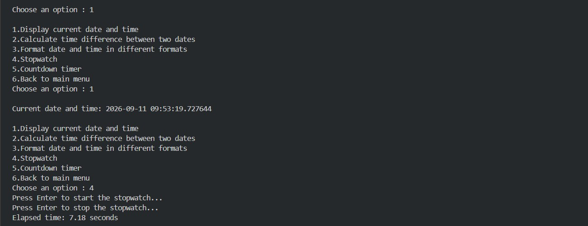
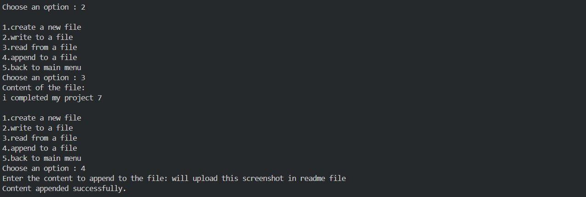
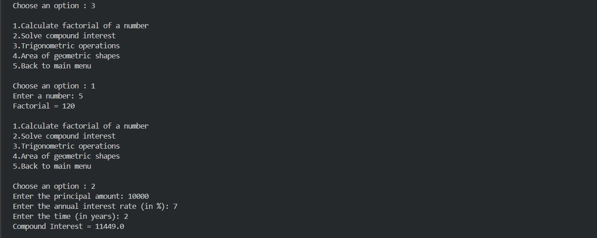
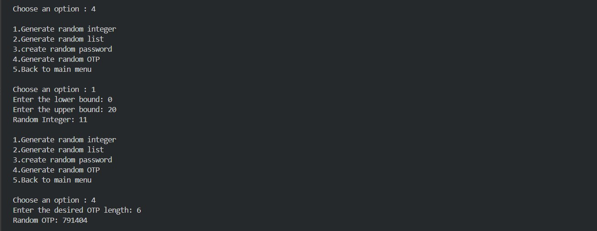
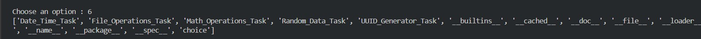

# Modules and Packages

## 📌 Project Description

**Modules and Packages** is a simple Python-based project that demonstrates how different Python modules can be created and imported into a main program.

The project is divided into separate files for **Date & Time Operations, File Operations, Math Operations, Random Data, and UUID Generation**. The main Python file imports these modules and provides a menu-driven interface to access their functions.

---

## 🛠️ Technologies Used

* Python
* Python Modules
* Functions
* `datetime` module
* `os` module
* `random` module
* `uuid` module
* `dir()` function

---

## ✨ Features

1. Date & Time Operations
2. File Operations
3. Math Operations
4. Random Data Generation
5. UUID Generation
6. Explore Module Attributes
7. Exit the program

---

# 📚 Exercises / Features

## 1. Date & Time Operations

This option allows the user to perform different **date and time related operations**.

The operation is handled by the `Date_Time_Operations.py` module.

The main program calls:

```python
Date_Time_Task()
```
### 📸 Output Screenshot



---

## 2. File Operations

This option allows the user to perform different **file-related operations**.

The operation is handled by the `file_operations.py` module.

The main program calls:

```python
File_Operations_Task()
```

### 📸 Output Screenshot



---

## 3. Math Operations

This option allows the user to perform different **mathematical operations**.

The operation is handled by the `math_operations.py` module.

The main program calls:

```python
Math_Operations_Task()
```

### 📸 Output Screenshot



---

## 4. Random Data

This option allows the user to generate different types of **random data**.

The operation is handled by the `random_data.py` module.

The main program calls:

```python
Random_Data_Task()
```

### 📸 Output Screenshot



---

## 5. UUID Generator

This option allows the user to generate a **UUID (Universally Unique Identifier)**.

The operation is handled by the `uuid_generator.py` module.

The main program calls:

```python
UUID_Generator_Task()
```

### 📸 Output Screenshot


---

## 6. Explore Module Attributes

This option demonstrates the use of Python's built-in **`dir()` function**.

The main program uses:

```python
print(dir())
```

The `dir()` function displays the names of attributes and objects available in the current scope.

This helps in exploring the functions and attributes available in the program.

### 📸 Output Screenshot



---

# 📋 Main Menu

When the program starts, it displays the following menu:

```text
==================================================
Welcome to the program...
==================================================

1. Date & Time Operations
2. File Operations
3. Math Operations
4. Random Data
5. UUID Generator
6. Explore Module Attributes
7. Exit
```

The user can select an option by entering a number from **1 to 7**.

---

## 📁 Project Structure

```text
Project 7/
│
├── Moduler_Packager.py
├── Date_Time_Operations.py
├── file_operations.py
├── math_operations.py
├── random_data.py
├── uuid_generator.py
└── README.md
```

* **Moduler_Packager.py** → Contains the main program and menu.
* **Date_Time_Operations.py** → Contains date and time operations.
* **file_operations.py** → Contains file operations.
* **math_operations.py** → Contains mathematical operations.
* **random_data.py** → Contains random data operations.
* **uuid_generator.py** → Contains UUID generation operations.
* **README.md** → Contains project documentation.

---

## 🎯 Learning Outcomes

Through this project, the following concepts are practiced:

* Python modules
* Importing functions from modules
* Creating separate Python files
* Functions
* User input
* `if __name__ == "__main__":`
* `match-case` statement
* `dir()` function
* Date and time operations
* File operations
* Mathematical operations
* Random data generation
* UUID generation
* Menu-driven programs

---

## 👩‍💻 Conclusion

The **Modules and Packages** project is a simple Python project designed to demonstrate the practical use of modules and functions.

By separating different operations into individual Python files and importing them into the main program, the project makes the code more **organized, reusable, and easier to maintain**.
