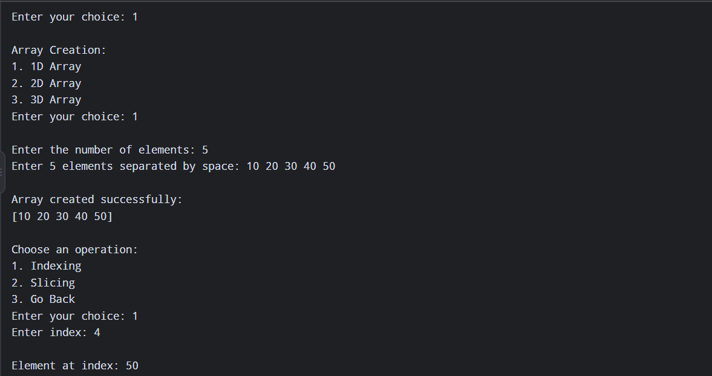
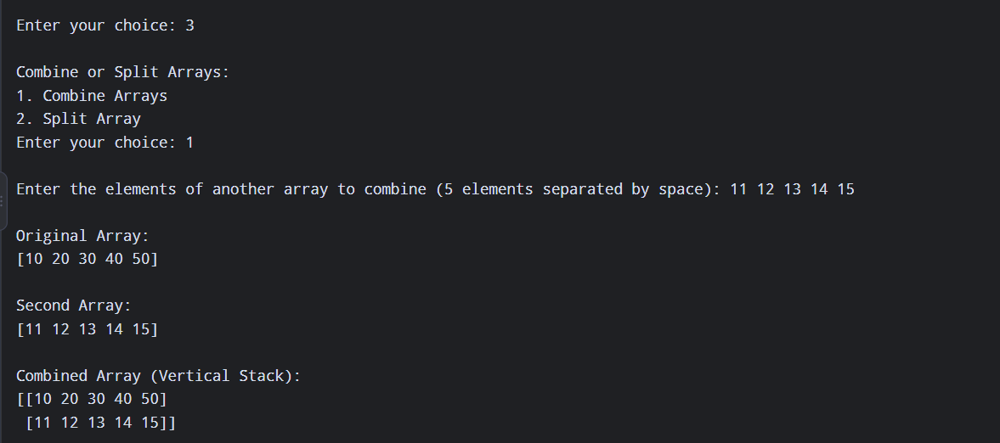
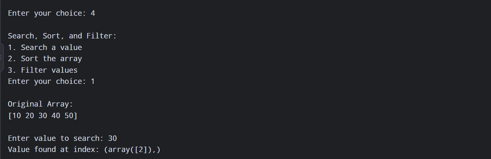
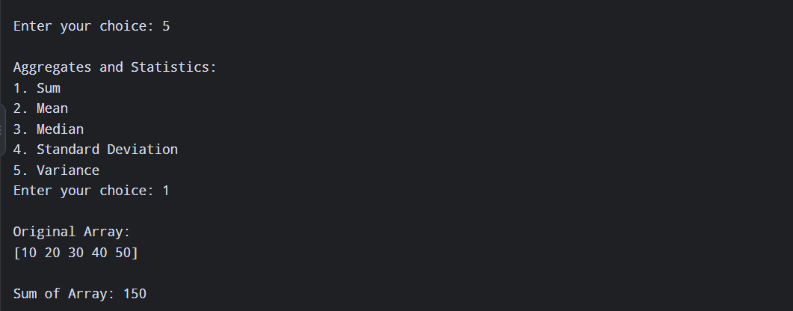

# NumPy Analyzer

## 📌 Project Description

**NumPy Analyzer** is a simple Python-based project that demonstrates the use of the **NumPy library** for creating and working with numerical arrays.

The project provides a menu-driven interface for different NumPy operations such as **array creation, mathematical functions, combining or splitting arrays, searching/sorting/filtering arrays, and computing aggregates and statistics**.

The project starts by importing NumPy and displaying a welcome message.

---

## 🛠️ Technologies Used

* Python
* NumPy
* Functions
* NumPy Arrays
* User Input
* Menu-driven Program
* `while` loop
* Conditional statements

---

## ✨ Features

1. Create a NumPy Array
2. Perform Mathematical Functions
3. Combine or Split Arrays
4. Search, Sort or Filter Arrays
5. Compute Aggregates and Statistics
6. Exit the program

---

# 📚 Exercises / Features

## 1. Create a NumPy Array

This option is used to create NumPy arrays.

The project provides options to create:

* 1D Array
* 2D Array

The array creation is handled by the `createarray()` function.

```python
def createarray():
```

### 1D Array

The user can enter multiple values separated by spaces, which are converted into a NumPy array.

```python
values = list(map(int, input("Enter 1D array values: ").split()))
return np.array(values)
```

### 2D Array

The user can enter the number of rows, columns, and array values. The values are then reshaped into a 2D NumPy array.

```python
return np.array(values).reshape(rows, cols)
```

### 📸 Output Screenshot



> **Screenshot 1: NumPy Array Creation**

---

## 2. Perform Mathematical Functions

This option is provided for performing different **mathematical operations on NumPy arrays**.

The mathematical functions can be added and performed using NumPy's built-in mathematical functions.

### 📸 Output Screenshot


> **Screenshot 2: Mathematical Functions**

---

## 3. Combine or Split Arrays

This option is provided for working with multiple NumPy arrays by **combining or splitting arrays**.

It can be used to demonstrate NumPy operations for joining and separating arrays.

### 📸 Output Screenshot



> **Screenshot 3: Combine or Split Arrays**

---

## 4. Search, Sort or Filter Arrays

This option is provided for performing different operations on NumPy arrays, including:

* Searching elements
* Sorting arrays
* Filtering array elements

These operations help in analyzing and manipulating array data.

### 📸 Output Screenshot



> **Screenshot 4: Search, Sort or Filter Arrays**

---

## 5. Compute Aggregates and Statistics

This option is provided for calculating **aggregate and statistical values** from NumPy arrays.

It can be used to demonstrate operations such as calculating values from the complete array.

### 📸 Output Screenshot



> **Screenshot 5: Aggregates and Statistics**

---

# 📋 Main Menu

When the program starts, it displays the following menu:

```text
Welcome to numpy analyzer

1.Create a numpy array
2.Perform Mathamatical functions
3.Combine or split arrays
4.Search,sort or filter arrays
5.Compute aggregates and statistics
6.Exit
```

The user can select an option by entering a number from **1 to 6**.

---

## 📁 Project Structure

```text
NumPy Analyzer/
│
├── Numpy Analyzer.ipynb
└── README.md
```

* **Numpy Analyzer.ipynb** → Contains the NumPy Analyzer program.
* **README.md** → Contains project documentation.

---

## 🎯 Learning Outcomes

Through this project, the following concepts are practiced:

* NumPy library
* NumPy arrays
* 1D arrays
* 2D arrays
* Array reshaping
* Functions
* User input
* `if-elif-else` statements
* `while` loop
* Menu-driven programs
* Mathematical operations
* Array manipulation
* Searching, sorting and filtering
* Aggregates and statistics

---

## 👩‍💻 Conclusion

The **NumPy Analyzer** project is a simple Python project designed to practice the use of the **NumPy library and NumPy arrays**.

The menu-driven structure makes it easier to organize different array operations and provides practice with **functions, user input, loops, conditions, and numerical data processing**.
